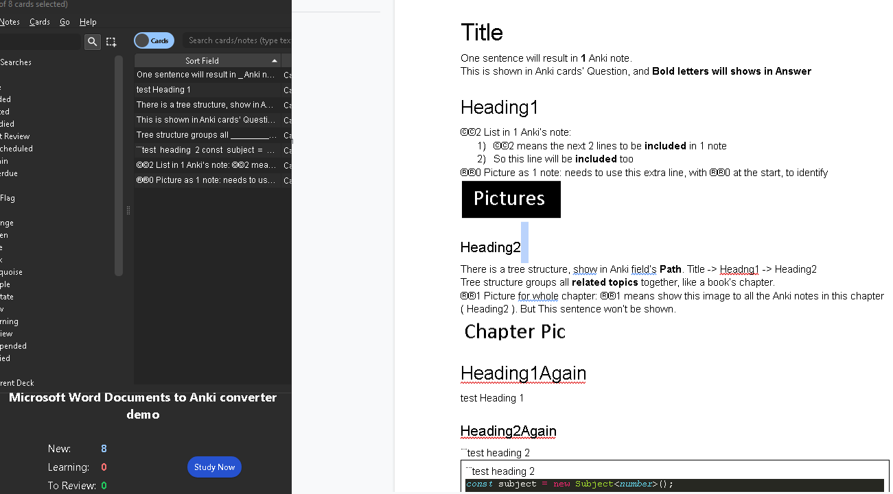
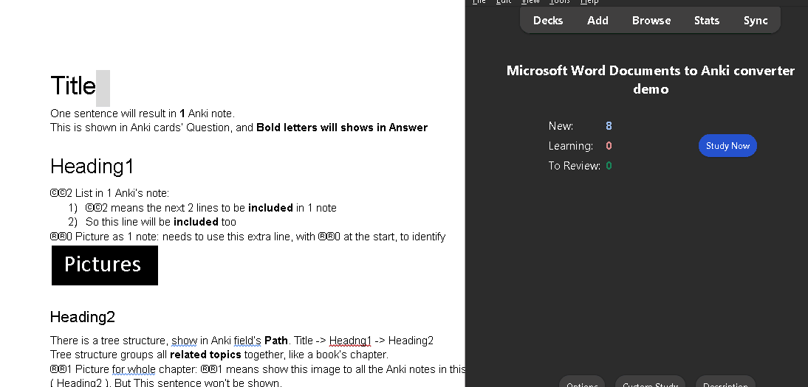
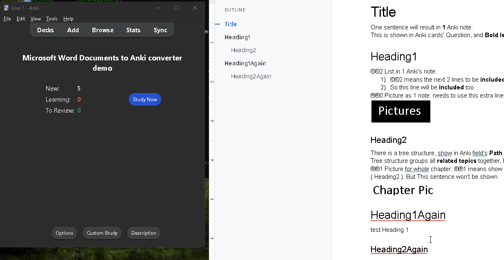
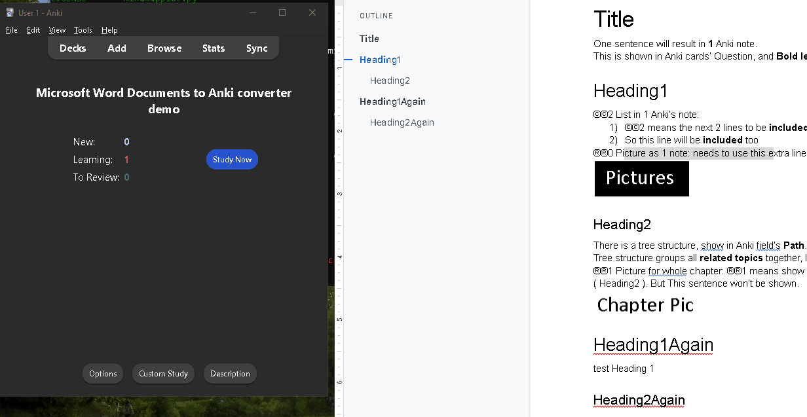
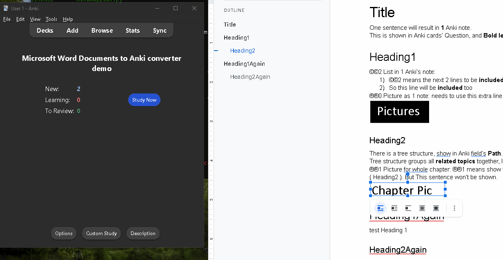
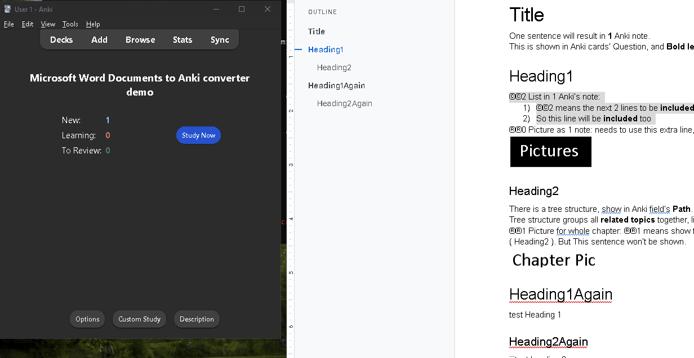
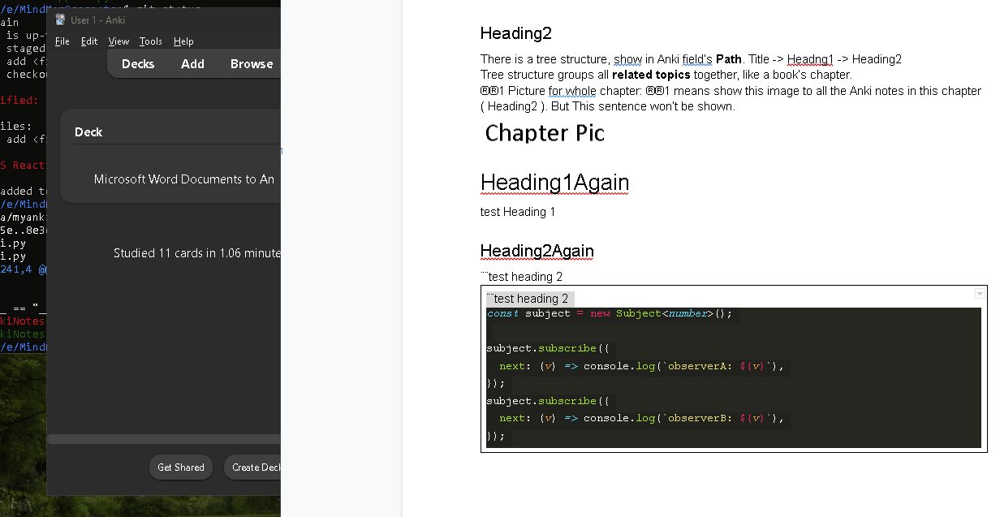

Convert Documents into Anki Note cards
# How to run
```shell
python3 myanki.py document.docx
```


# Feature

## Every sentences in the .docx documents is converted into Anki note cards


## Bold / Italic section will be hidden in Question field
Just bold the words you think needs to remember


## Support Table of contents, and show what this note comes from
Show you what section of the document this note comes from.

It is good when you have lots of notes.

This can be created through **Headings** in Document


## Support image as note
To create a image Note, make sure you use the following indicator:

®®0



## Images can be shown in multiple Anki notes
To add this image into all notes for this Heading/section, make sure you use the following indicator:

®®1

where, the number is how many level sub-section down you want to show


## Support List. multiple lines stored inside 1 note card
To add multiple lines into 1 note, use the following indicator:

©©2

where, 2, means 2 lines below will be included


## Support code block

To add a code block, make sure:

1) add a 1x1 table in the document
2) Paste the code inside
3) use the ¨¨ as an indicator ( NOT double quote, it is U+00A8 )
4) Copy the same line ( with ¨¨ ), on both **outside and inside** of the 1st line of the table.
( Sorry, working on a simplier way right now... )



## Sample
Download the sample document:
Microsoft Word Documents to Anki converter demo.docx
